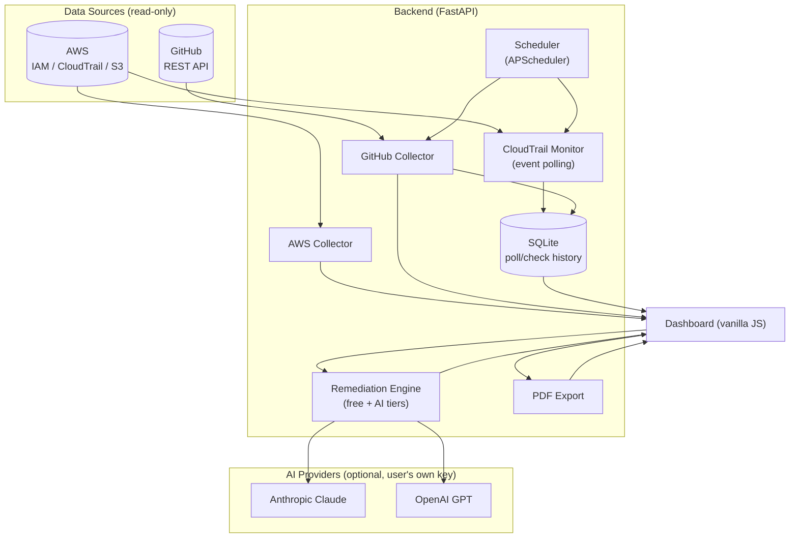

# SOC 2 Evidence Collector


**Automated audit evidence collection for small teams without dedicated compliance staff.**

## Why this exists

SOC 2 compliance is a near-mandatory requirement for any B2B SaaS company selling to mid-market or enterprise customers — but the evidence-gathering process (screenshotting IAM configs, exporting access logs, documenting change approvals) is manual, repetitive, and often costs small companies thousands of dollars per audit cycle in either engineering hours or outsourced compliance consulting. Commercial platforms (Vanta, Drata, Secureframe) solve this well for companies that can afford $10,000-$100,000+/year — this project is a free, open-source alternative for teams that can't.

This project automates the evidence-collection layer of SOC 2 readiness — pulling access control, logging, and change-management evidence directly from AWS and GitHub, mapping it to specific SOC 2 Trust Service Criteria, continuously monitoring for changes, and using AI to translate findings into plain-English guidance — so a small engineering team can generate an audit-ready evidence package in minutes instead of weeks.

## Who this is for

Early-stage startups and small engineering teams (typically 2-50 engineers) pursuing their first SOC 2 audit, who don't yet have budget for a dedicated compliance platform or consultant.

## What it checks today

| Trust Service Criterion | AWS Evidence | GitHub Evidence |
|---|---|---|
| CC6.1 — Logical access control | IAM users, MFA enforcement, active access keys | Repository access list, admin count |
| CC6.2 — Credential rotation / periodic access review | Access key age and last-used date, flagged if stale (90+ days) | — |
| CC6.6 — Security configuration | S3 public access block settings | — |
| CC7.2 — Logging & monitoring | CloudTrail logging status, multi-region config | — |
| CC8.1 — Change management | — | Branch protection, required PR reviews |

All checks are **read-only** — this tool never modifies your AWS or GitHub configuration.

## Features

- **Core evidence collection** — AWS (IAM/MFA, CloudTrail, S3, access key rotation) and GitHub (access control, branch protection), mapped to specific SOC 2 criteria
- **Continuous Monitoring** — polls CloudTrail for relevant activity and GitHub for branch-protection state changes on an interval. Targeted, not a blind full re-scan: only re-checks when something actually changed. Full poll/change history stored locally (SQLite)
- **Remediation guidance (two-tier)** — every failing finding includes free, curated fix-it guidance by default. Optionally, bring your own Anthropic or OpenAI API key for AI-tailored guidance naming the exact resource involved
- **AI executive report** — generates a plain-English security posture summary for a non-technical business owner, downloadable as a PDF
- **Multi-provider AI support** — Anthropic (Claude) or OpenAI (GPT), your choice, your own API key, never stored

## Real-world validation

This tool has been run end-to-end against real (not synthetic) AWS and GitHub accounts to confirm it works correctly, including using its own findings to drive actual remediation:

**Before:**

| Control | Result |
|---|---|
| IAM MFA enforcement (CC6.1) | 0/16 users had MFA enabled |
| CloudTrail logging (CC7.2) | 1 trail evaluated — logging enabled, multi-region, log file validation on — **PASS** |
| S3 public access block (CC6.6) | 0/6 buckets had public access blocked |
| Branch protection (CC8.1) | 0/14 repositories required PR review on their default branch |

**After remediating one finding on each platform (enabling MFA on one IAM user, adding a branch-protection rule to one repository) and re-running the collector:**

| Control | Before | After |
|---|---|---|
| IAM MFA — target user | FAIL | **PASS** |
| Branch protection — target repository | FAIL | **PASS** |

**Continuous Monitoring** was separately validated by deleting a real IAM user and confirming the poller correctly detected the `DeleteUser` CloudTrail event and triggered a re-check — while correctly reporting zero false positives across preceding polls with no real activity.

**AI remediation and the executive report** were validated live against real findings with both supported providers (Anthropic and OpenAI), correctly naming specific resources (e.g. a specific repository and branch) rather than returning generic text.

This confirms the tool correctly detects both the initial gap and the fix, rather than just returning a static or hardcoded result.

## Architecture



```
soc2-evidence-collector/
├── .github/workflows/
│   └── tests.yml               # CI: runs the test suite on every push/PR
├── backend/
│   ├── main.py                 # FastAPI app, API endpoints
│   ├── db.py                   # SQLite layer for monitoring history
│   ├── monitoring.py           # Continuous Monitoring scheduler
│   ├── remediation.py          # Two-tier remediation guidance (free + AI)
│   ├── pdf_export.py           # PDF generation for the executive report
│   ├── collectors/
│   │   ├── aws_collector.py        # AWS evidence collection (boto3)
│   │   ├── github_collector.py     # GitHub evidence collection (REST API)
│   │   └── cloudtrail_monitor.py   # CloudTrail event polling
│   └── requirements.txt
├── frontend/
│   └── index.html               # Dashboard (vanilla JS, no build step)
└── tests/                       # pytest suite — see Testing section below
```

## Setup

### Prerequisites
- Python 3.10+
- AWS credentials configured (`aws configure`, or environment variables) with read-only IAM/CloudTrail/S3 permissions
- A GitHub personal access token with `repo` scope (classic token — needed for branch protection visibility, not just `public_repo`)
- (Optional) An Anthropic or OpenAI API key, for AI-tailored remediation and the executive report

### Install and run

```bash
cd backend
pip install -r requirements.txt
uvicorn main:app --reload --port 8000
```

Then open `http://localhost:8000` in your browser.

### Recommended AWS IAM policy (read-only, least-privilege)

```json
{
  "Version": "2012-10-17",
  "Statement": [
    {
      "Effect": "Allow",
      "Action": [
        "iam:ListUsers",
        "iam:ListMFADevices",
        "iam:ListAccessKeys",
        "iam:GetAccessKeyLastUsed",
        "cloudtrail:DescribeTrails",
        "cloudtrail:GetTrailStatus",
        "cloudtrail:LookupEvents",
        "s3:ListAllMyBuckets",
        "s3:GetPublicAccessBlock"
      ],
      "Resource": "*"
    }
  ]
}
```

## Testing

A full pytest suite covers the core logic — the diffing/polling behavior, both AI providers (mocked, no real API key needed), and the regression test for a real bug we found (CloudTrail permission errors being silently treated as "0 events found" instead of being surfaced as an error).

```bash
pip install -r backend/requirements.txt
pip install pytest
python -m pytest tests/ -v
```

Tests run automatically on every push via GitHub Actions (see badge above).

## Roadmap

- [x] ~~PDF export of evidence reports~~ — done
- [x] ~~Scheduled/recurring collection~~ — done (Continuous Monitoring)
- [x] ~~AI-assisted remediation guidance~~ — done
- [ ] Support for GCP and Azure
- [ ] Google Workspace integration
- [ ] Slack/email notifications when a control moves from PASS to FAIL
- [ ] Multi-entity/workspace support (for consultants managing multiple clients)
- [ ] Additional Trust Service Criteria coverage (Availability, Confidentiality categories)

## Contributing

This is an early-stage, actively-maintained open-source project. Issues and pull requests are welcome — see the roadmap above for areas that need work.

## License

MIT
